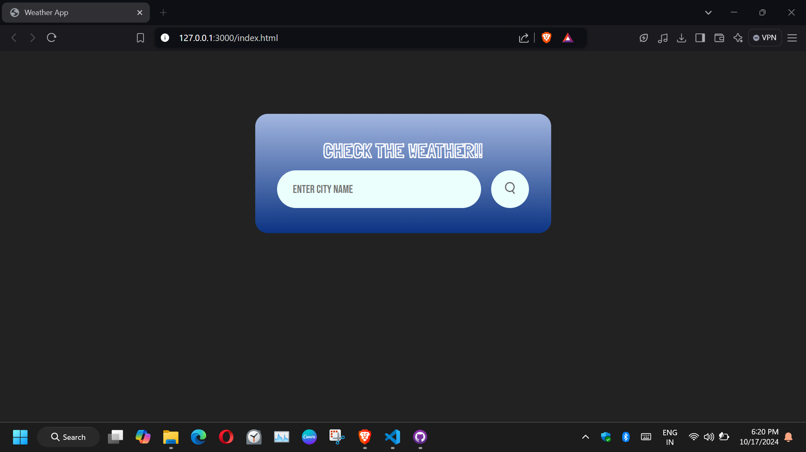
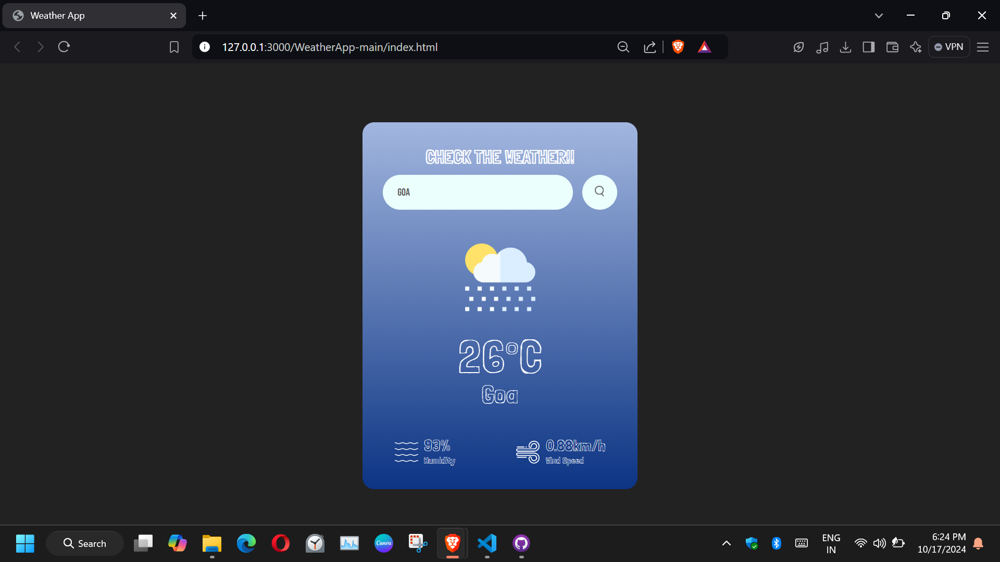
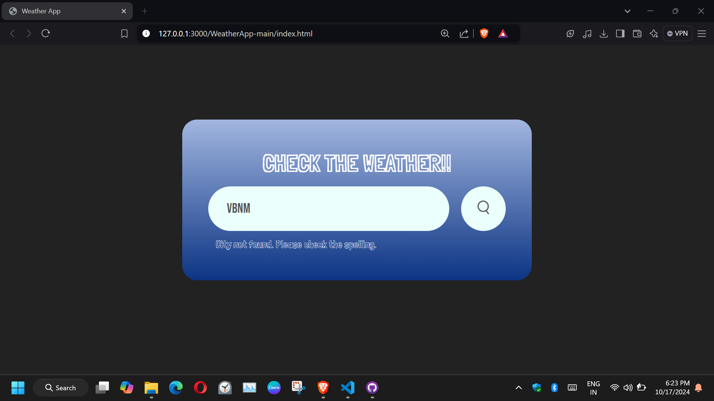
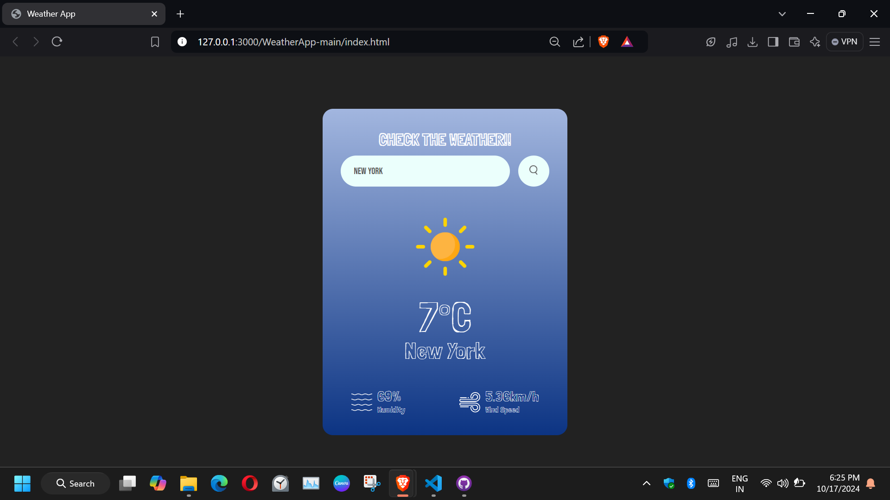

# Weather Tracker App

A simple, real-time weather tracking application that provides users with the latest weather updates based on city names. Built using HTML, CSS, and JavaScript, the app fetches data from the OpenWeatherMap API and displays essential weather details like temperature, humidity, wind speed, and weather conditions.

## Features

- **Real-Time Weather Data**: Enter a city name to get current weather information.
- **Visual Indicators**: Display weather conditions with icons (Clear, Clouds, Rain, Drizzle, Mist).
- **Error Handling**: Alerts the user if the city is not found or if there are issues with the API.
- **Responsive Search**: Initiate search with the "Search" button or press the "Enter" key.
- **Loading Indicator**: Displays a loading spinner during the fetch process to improve user experience.

## Screenshots

### 1. Weather Search Page


### 2. Weather Results


### 3. Error Message for Invalid City


## Technologies Used

- **HTML5** for structuring the web page.
- **CSS3** for styling and layout.
- **JavaScript (ES6)** for dynamic content updates and API calls.
- **OpenWeatherMap API** for fetching real-time weather data.

## Installation and Setup

1. Clone this repository:
    ```bash
    git clone https://github.com/your-username/weather-app.git
    ```

2. Open the project directory:
    ```bash
    cd weather-app
    ```

3. Open the `index.html` file in your preferred browser.

4. Ensure you have an active internet connection to allow the app to fetch data from the OpenWeatherMap API.

## How It Works

1. **Search**: Enter the name of the city in the input box and either press "Enter" or click the "Search" button.
2. **Weather Data**: The app will fetch and display the weather data for the entered city, including:
   - City name
   - Temperature (in Celsius)
   - Humidity
   - Wind speed
   - Weather condition (with appropriate icon)
3. **Error Handling**: If the city is not found, the app will display an error message.

### Example: Display Weather for New York


## API Key Setup

This app uses the OpenWeatherMap API to fetch weather data. To run the app, you need to replace the default API key in the JavaScript code (`app.js`):

1. Go to [OpenWeatherMap](https://openweathermap.org/api) and create an account.
2. Generate an API key.
3. Replace the existing API key in the `app.js` file:
    ```javascript
    const apiKey = "your_api_key_here";
    ```

## Contributing

Contributions are welcome! If you have suggestions or improvements, feel free to open an issue or submit a pull request.

## License

This project is licensed under the MIT License. See the [LICENSE](LICENSE) file for details.

